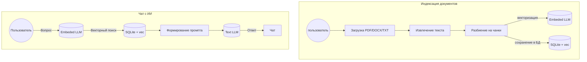

# LocalAiSearcher

**LocalAiSearcher** — это полностью автономное десктопное приложение с искусственным интеллектом для работы с документами (Retrieval-Augmented Generation, RAG). 

Оно позволяет загружать ваши документы (PDF, DOCX, TXT, MD) и задавать вопросы по их содержимому. Вся обработка, включая генерацию эмбеддингов и ответов LLM, происходит **исключительно локально** на вашем компьютере.

Также присутствует возможность просмотра истории чатов.

## Ключевые особенности

*   **Приватность:** Приложение не требует подключения к интернету ни для установки, ни для работы. Никакие данные не покидают ваше устройство.
*   **Всё включено:** Не нужно дополнительно устанавливать и настраивать другие сервисы. ИИ-модели поставляются в комплекте с инсталлятором.
*   **Кроссплатформенность:** Нативный десктопный интерфейс для Windows, macOS и Linux.
*   **Современный стек:** Построено на базе платформы **.NET 10**.
*   **Заменяемость моделей:** Присутствует возможность использования LLM моделей, не входящих в стандартную поставку приложения.

## Архитектура и схема работы (RAG)

Процесс работы разделен на два основных потока: **Индексация документов** (Background) и **Ответы на вопросы** (Chat).

## Технологический стек

*   **Платформа:** .NET 10 (C#)
*   **UI:** Avalonia UI (MVVM)
*   **LLM Engine:** LLamaSharp (обертка над llama.cpp)
*   **Векторная БД:** SQLite + расширение sqlite-vec
*   **Парсинг:** UglyToad.PdfPig (PDF), DocumentFormat.OpenXml (DOCX)
*   **Упаковка:** Velopack

## Модели в комплекте

Приложение по умолчанию использует следующие оптимизированные модели (в формате GGUF):
*   `nomic-embed-text` (~274 MB) — для создания векторных представлений текста.
*   `T-lite-it` Q6_K (~6.0 GB) — для генерации ответов.
 