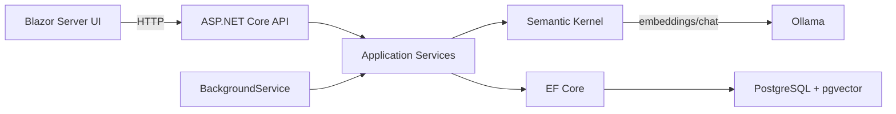

# План реализации AI-Ассистента (локальный RAG)

## Архитектура

Проект состоит из **одного .NET solution** с четырьмя проектами (Domain, Application, Infrastructure, WebAPI) и Blazor UI как отдельный проект. Всё запускается через Docker Compose.

---

## [x] Этап 0: Скаффолдинг проекта

- Создать структуру solution `LocalAiSearcher.sln` с проектами:
  - `src/Domain` (class library) — сущности, перечисления
  - `src/Application` (class library) — интерфейсы, сервисы, DTO
  - `src/Infrastructure` (class library) — EF Core, Ollama-коннектор, экстракторы текста, фоновые задачи
  - `src/WebAPI` (ASP.NET Core 9 web app) — Minimal API endpoints, Program.cs
  - `src/BlazorUI` (Blazor Server app) — UI
- Создать `.gitignore` для .NET, `README.md`
- Добавить NuGet-пакеты:
  - `Npgsql.EntityFrameworkCore.PostgreSQL`, `Pgvector.EntityFrameworkCore` — для pgvector
  - `Microsoft.SemanticKernel` — AI-оркестрация
  - `Serilog.AspNetCore`, `Serilog.Sinks.Console`, `Serilog.Sinks.File` — логирование
  - `DocumentFormat.OpenXml` — извлечение DOCX
  - `UglyToad.PdfPig` — извлечение PDF

## [x] Этап 1: Docker Compose + инфраструктура

- `docker-compose.yml` с сервисами: `postgres` (pgvector/pgvector:pg17), `ollama` (ollama/ollama:latest), `backend`, `frontend`
- `Dockerfile.backend` — multi-stage build для WebAPI
- `Dockerfile.frontend` — multi-stage build для BlazorUI
- Init-скрипт для Ollama (автоматический `ollama pull nomic-embed-text` и `ollama pull llama3.2:3b`)

## [ ] Этап 2: Domain-слой

Файлы в `src/Domain/`:

- `Entities/Document.cs` — id (UUID), filename, file_path, content_type, status, uploaded_at
- `Entities/DocumentChunk.cs` — id (UUID), document_id (FK), content, embedding (Vector), metadata (jsonb), created_at
- `Enums/DocumentStatus.cs` — Pending, Processing, Completed, Failed

## [ ] Этап 3: Infrastructure — БД и EF Core

- `Data/AppDbContext.cs` — DbContext с DbSet для Document, DocumentChunk; настройка pgvector
- `Data/Configurations/DocumentConfiguration.cs` — Fluent API конфигурация
- `Data/Configurations/DocumentChunkConfiguration.cs` — настройка vector(768), индекс IVFFlat
- `Data/Repositories/DocumentRepository.cs` — CRUD для документов
- `Data/Repositories/VectorRepository.cs` — поиск по косинусному сходству (топ-5), сохранение чанков
- EF Core миграции через `dotnet ef migrations add InitialCreate`

## [ ] Этап 4: Infrastructure — извлечение текста

- `TextExtraction/ITextExtractor.cs` (интерфейс в Application)
- `TextExtraction/PdfTextExtractor.cs` — через UglyToad.PdfPig
- `TextExtraction/DocxTextExtractor.cs` — через DocumentFormat.OpenXml
- `TextExtraction/TextFileExtractor.cs` — для TXT/MD (простое чтение)
- `TextExtraction/TextExtractorFactory.cs` — выбор экстрактора по content_type

## [ ] Этап 5: Application — сервисы обработки

- `Services/ChunkingService.cs` — разбиение текста на чанки (500-1000 символов, overlap 100-200)
- `Services/DocumentProcessingService.cs` — оркестрация pipeline: извлечение -> очистка -> чанкинг -> эмбеддинги -> сохранение
- `Services/RagService.cs` — RAG-цикл: эмбеддинг вопроса -> векторный поиск -> формирование промпта -> LLM -> ответ с источниками

## [ ] Этап 6: Infrastructure — Semantic Kernel + Ollama

- `AI/SemanticKernelSetup.cs` — extension method для регистрации Kernel в DI:
  - `AddOllamaChatCompletion` для генерации (llama3.2:3b)
  - `AddOllamaTextEmbeddingGeneration` для эмбеддингов (nomic-embed-text)
- Конфигурация через `appsettings.json` секция `Ollama` (Endpoint, ChatModel, EmbeddingModel)

## [ ] Этап 7: Infrastructure — фоновая обработка

- `BackgroundJobs/DocumentProcessingBackgroundService.cs`:
  - `Channel<Guid>` как внутренняя очередь
  - `BackgroundService` читает из канала и вызывает `DocumentProcessingService`
  - Обновление статуса документа: Pending -> Processing -> Completed/Failed
  - Обработка ошибок с логированием

## [ ] Этап 8: WebAPI — эндпоинты

- `Program.cs` — конфигурация DI, Serilog, CORS, Health Checks
- `Endpoints/DocumentEndpoints.cs` (Minimal API):
  - `POST /api/documents` — загрузка файла, сохранение на диск, запись в БД, постановка в очередь
  - `GET /api/documents` — список документов со статусами
  - `DELETE /api/documents/{id}` — удаление с каскадом
- `Endpoints/ChatEndpoints.cs`:
  - `POST /api/chat` — принимает вопрос, вызывает RagService, возвращает ответ + источники
- Health Checks: PostgreSQL, Ollama connectivity

## [ ] Этап 9: Blazor UI

- `Components/Pages/Documents.razor` — загрузка файлов (drag-and-drop), таблица документов со статусами, кнопка удаления
- `Components/Pages/Home.razor` — чат-интерфейс в стиле ChatGPT: поле ввода, список сообщений, блок источников
- `Components/ChatMessage.razor` — компонент одного сообщения (user/assistant)
- `Components/Shared/MainLayout.razor` — навигация между страницами
- `Services/ApiClient.cs` — HTTP-клиент для обращения к WebAPI

## [ ] Этап 10: Логирование (Serilog)

- Настройка в `Program.cs` обоих проектов (WebAPI, BlazorUI)
- Sinks: Console + File (rotating, path `logs/`)
- Structured logging по всему pipeline (загрузка, обработка, чанкинг, эмбеддинги, поиск, генерация)
- Request logging middleware

## [ ] Этап 11: Финализация

- Полный README.md с инструкцией запуска
- `.gitignore` для .NET + Docker
- Проверка работы всего стека через Docker Compose
- Тестовый прогон: загрузка PDF -> обработка -> вопрос -> ответ с источниками
